# EKS, Flask App and Redis Deployment using Terraform and Docker Compose.

## Architecture

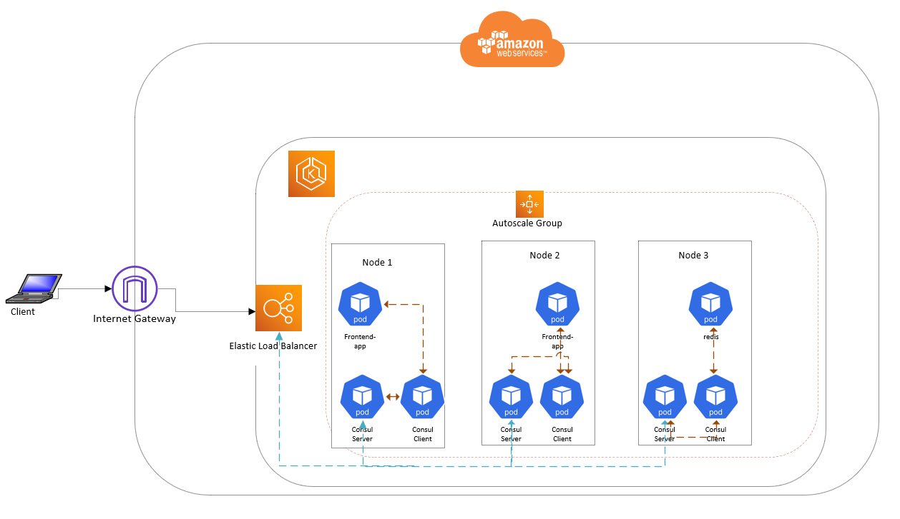

This repository contains the necesary scripts and procdedures to deploy a **simple** Flask App using a Redis vai Docker Compose and Kubectl with automatic service discovery by Consul. Also in includes the procedure and the necesary Terraform modules to automate the deployment of to EKS using EC2, AWS Auto Scaling and ELB.

- [Architecture](#architecture)
- [Enviroment](#enviroment)
- [Infrastructure](#aws-infrastructure)
- [Docker Compose](#docker-compose)
- [Configuring AWS Environment](#configuring-aws-environment)
- [Installation, Configuration and Deploment](#installation,-configuration-and-deploment)
- [Issues](#issues)

## Enviroment

The following work enviroment was used:

- Terraform v0.14
- Docker version 20.10.6-ce,
- Docker compose version 1.29.1,
- AWS-CLI aws-cli/2.2.4 Python/3.8.8 Linux/4.18.0-80.11.2.el8_0.x86_64
- Helm version 3.5.4

It is assumed you already have AWS account and Access keys created to configure a profile aws client on your development computer.

```bash
aws configure
```

Follow the prompts and enter the correct values based on your created access key.

## AWS Infrastructure

To do:

- Use any of your favorite web app ( flask, rails, django, or whatever else you like )
- Have two app nodes and Redis for storage
- Use Consul to do service discovery, so app can talk to Redis
- Ability to deploy app locally using Docker compose
- Ability to Deploy the same app to EKS ( use any automation you like, terraform, cloudformation etc)

## Docker Compose

In order to test and develop our app locally, use Docker and Docker Compose to set the necesary app enviroment and requirements.

The is is a very basic WEB APP was made in python and uses:

- Flask: As the framework.
- Redis: For database storage.

### Creating containers images and deploy

Image for the frontend app was built with docker command and uploaded to Docker hub. Consul already have docker images in docker repository for the server and client side.

Quick way:

```bash
cd ncloud_project
docker-compose build
docker-compose up
```

To tag the local image for docker push to you repository on Docker hub:

```bash
docker tag SOURCE_IMAGE[:TAG] TARGET_IMAGE[:TAG]
docker login
docker push TARGET_IMAGE[:TAG]
```

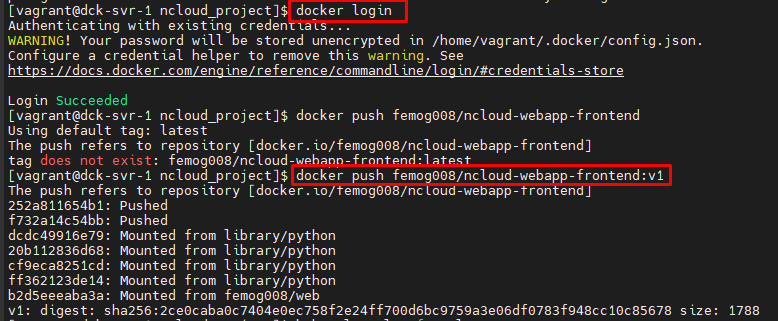

## Configuring AWS Environment

After successfully testing app functionality. docker-compose is converted to suitable yaml files for consul to automatically attach car-proxies for the containers.

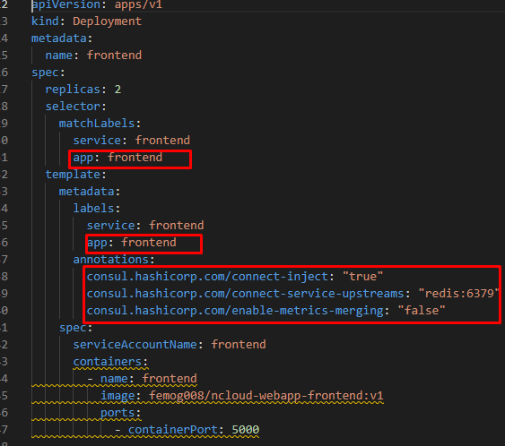

The highlighted sections are very crucial for consul to work seemlessly.

### Terraform config and repository creation

Before we can use Terraform we need to set some variables in order to access AWS. Open the file **terraform.tfvars** and modify the variables with your own.

- aws_profile = "YOUR_PROFILE"
- aws_region = "YOUR_AWS_DEFAULT_REGION"

After that, run the following to change into directory, initialize Terraform and run the planner.

```bash
cd Infrastructure
terraform init
terraform plan
```

This is going to show us the plan to create all the components needed to run EKS on AWS before the images will be deployed as containers in a pod.

Check the output of the command and verify the resources generated:

```bash
terraform apply
```

Type **yes** for confirmation. A successful deployment will have resources deployed as shown in the images below:

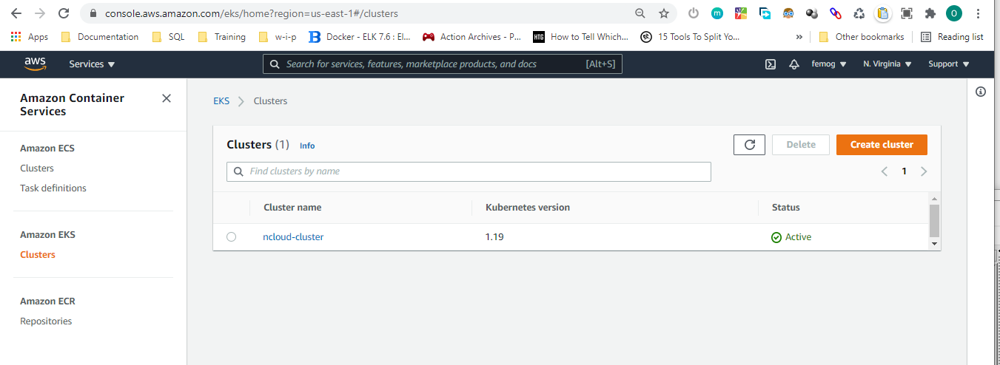
_EKS Cluster_

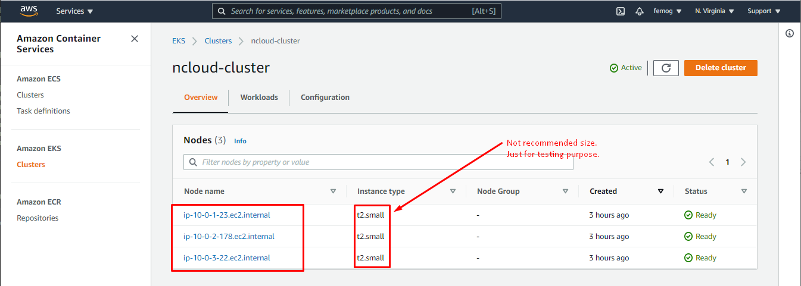
_Ec2 Instances in Autoscale Group_

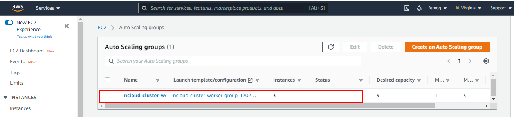
_Autoscale Group_

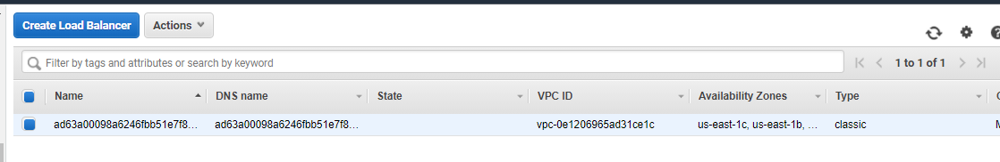
_Loadbalancer_

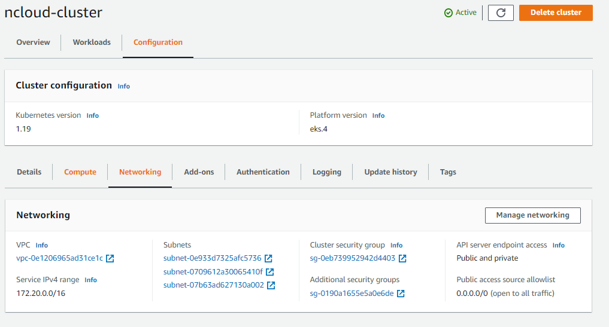
_Network Components_

Finally, run the following command to get the kubeconfig applied to your workspace:

```bash
aws eks update-kubeconfig --name [name-of-cluster] --region [aws-region-cluster-deployed]
```

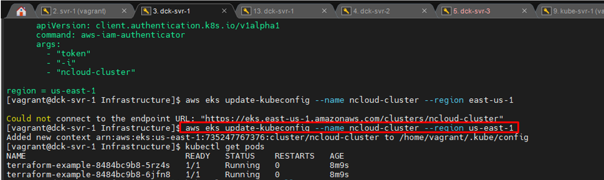

## Installation, Configuration and Deploment

### Install Consul to EKS - recommended way!

There are different methods to install Consul to kubernetes, but the recommended way is to use the Helm Chart.

To do this ensure that you have installed Helm on your workstation.

Run the command to install consul on your EKS instance:

```bash
helm install consul hashicorp/consul --set globla.name=consul
```

or set desired parameters in a config file and add it to the command

```bash
helm install -f config.yaml consul hashicorp/consul
```

You can also apply the configuration afterwards by running:

```bash
helm upgrade -f config.yaml consul hashicorp/consul
```

A successful install will show consul pods deployed to the cluster.

Run the following command to view the deployment:

```bash
kubectl get pods --all-namespaces -owide
```

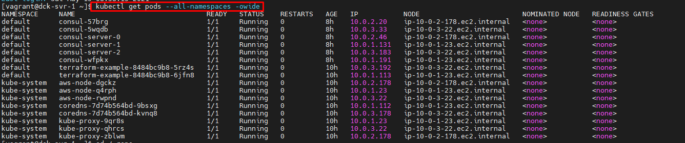

Run the following command to get the exposed address for the consul service:

```bash
kubectl get svc --all-namespaces -owide
```

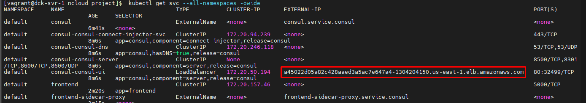

Open in a browser and see the web interface:

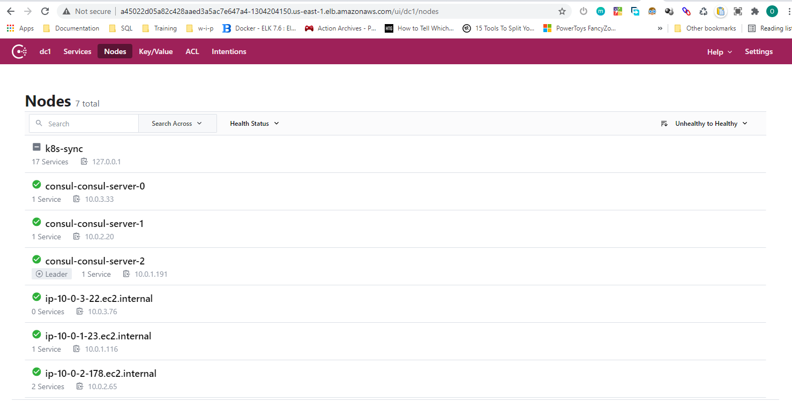

### Deploy Application to Kubernetes

The yamls files needed to successfully deploy the apps are already in this repo.

Change to the Deployments directory and run the command:

```bash
cd ../Deployments
kubectl apply -f Deployments/
kubectl get pods --all-namespaces -owide
```

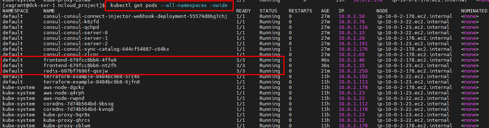

Check the Consul web url to confirm services have been registered automatically:

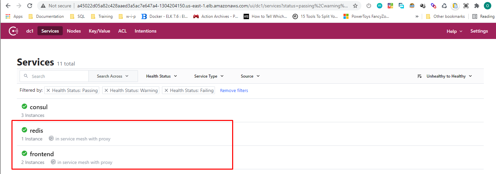
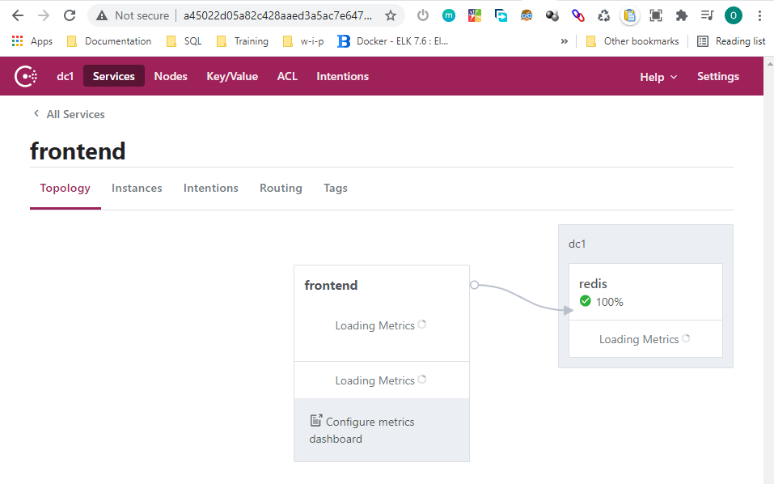
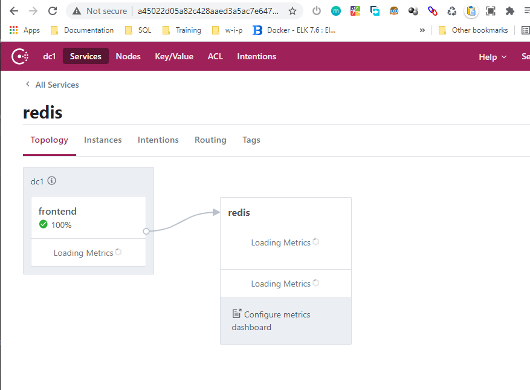

### DOCUMENTATION STILL IN PROGRESS

## Issues

- You may need to increase is capacity of the images selcted for the nodes in order to increase performance and follow recommended configuration requirements.

## Improvements

- Subsequent commits will improve workflow to automate installation of consul and deployment of application using any of the modern CI/CD pipeline applications.
